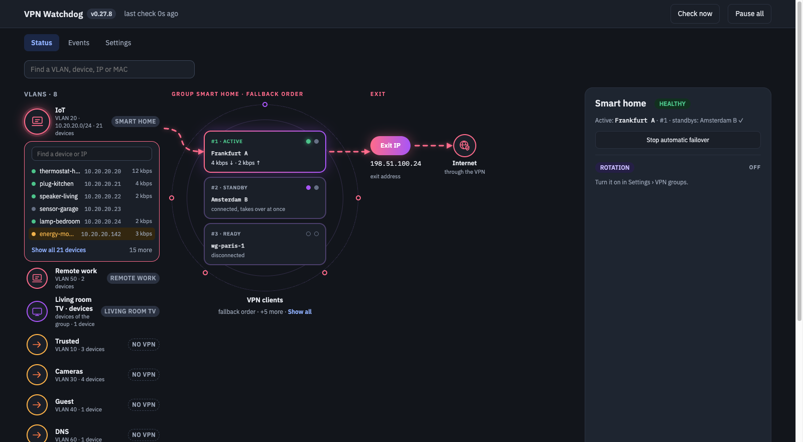

# Homelab Home Assistant add-ons

[](https://github.com/bassem-elsodany/homelab-ha-addons/actions/workflows/ci.yml) [](LICENSE)

Add-ons for a Home Assistant homelab, built and run at home. Add this repository once and everything in it appears in the Add-on Store.
One keeps your UniFi VLANs and devices on a working WireGuard VPN and fails over between VPN clients automatically; another puts a Technitium DNS Server dashboard in your sidebar.



**Topics:** home-assistant · home-assistant-addon · unifi · wireguard · vpn · failover · technitium · dns · homelab · self-hosted

## Install
1. Home Assistant (OS or Supervised): **Settings → Add-ons → Add-on Store → ⋮ → Repositories**
2. Add `https://github.com/bassem-elsodany/homelab-ha-addons` and press **Add**.
3. Pick an add-on from the list below, install it, and follow its documentation.

## Add-ons

| Add-on | What it does |
|---|---|
| [**UniFi VPN Watchdog**](unifi-vpn-watchdog/README.md) | Groups your UniFi VLANs and devices with an ordered list of WireGuard VPN clients, health-checks the one in use and fails over to the next when it stops carrying traffic. Can rotate clients on a timer, keep warm standbys, and (optionally) keep routing policies pointed at the active client. Graphic status map, settings and a phone layout in a Home Assistant sidebar panel. [Add-on docs](unifi-vpn-watchdog/DOCS.md) |
| [**Resolvr**](resolvr/README.md) | A monitoring dashboard for Technitium DNS Server in a sidebar panel: live query traffic, clients, query logs, cache, zones, DHCP, and block-list status with an Update now button. Uses your Home Assistant sign-in; set the Technitium address and API token in the Configuration tab. Runs the published [Resolvr](https://github.com/bassem-elsodany/resolvr-dns-dashboard) image. [Add-on docs](resolvr/DOCS.md) |

| UniFi VPN Watchdog | Resolvr |
|---|---|
|  |  |

More add-ons will be added as folders next to this one, each with its own README.

## Layout

```
repository.yaml        what Home Assistant reads when you add this repository
<add-on>/              one folder per add-on (config.yaml, DOCS.md, README.md, icon.png, logo.png; plus a Dockerfile and source
                       for add-ons built here, or just an image: line for add-ons that run a published image, like resolvr/)
```

The UniFi VPN Watchdog code also runs as a plain Docker container (see `unifi-vpn-watchdog/docker/`).

## License

[MIT](LICENSE) © 2026 Bassem Elsodany.
