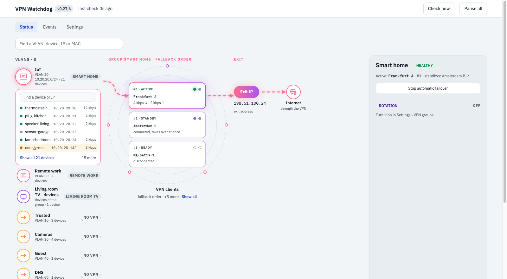
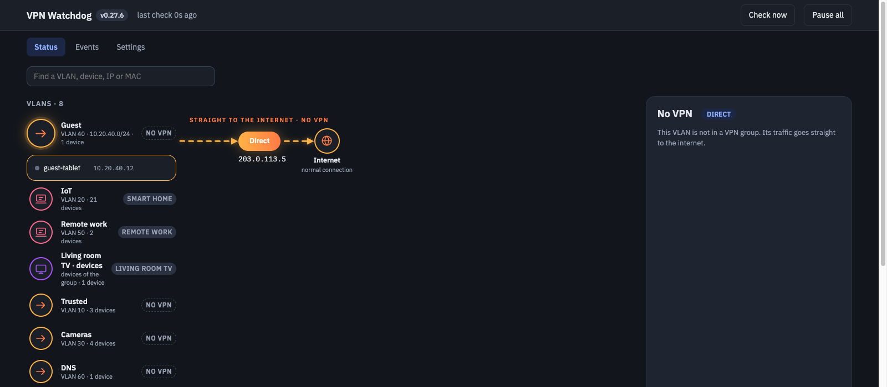
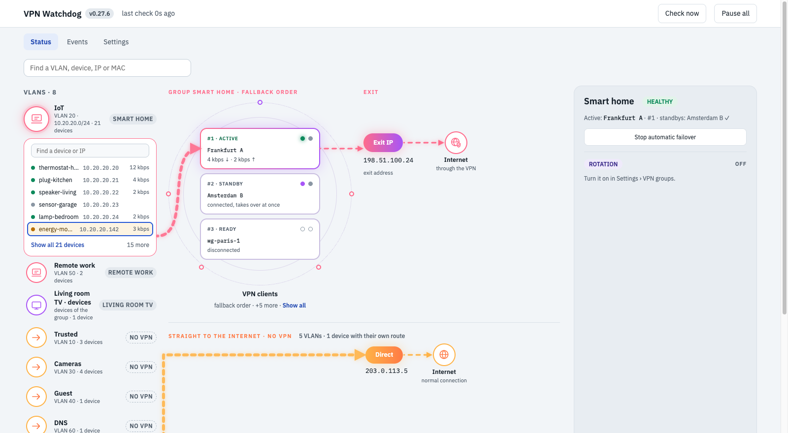
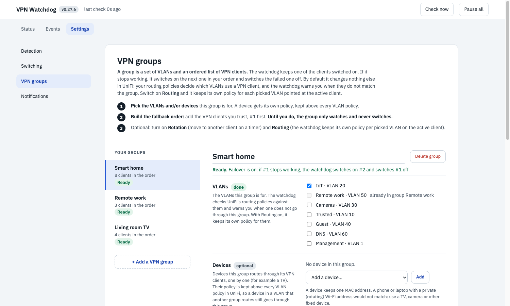
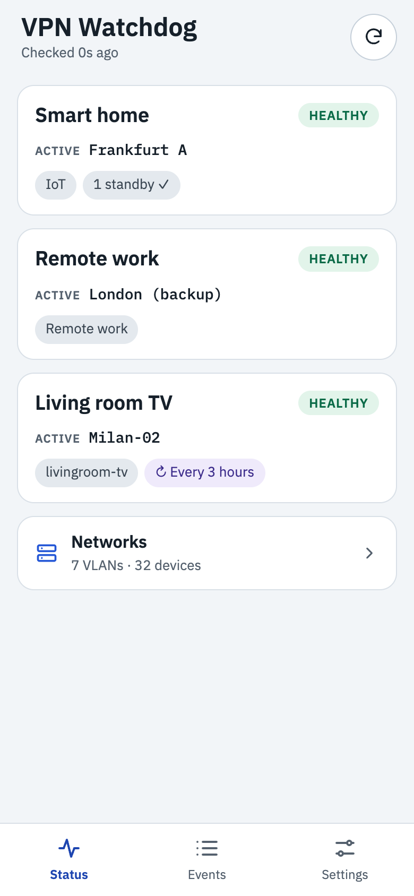
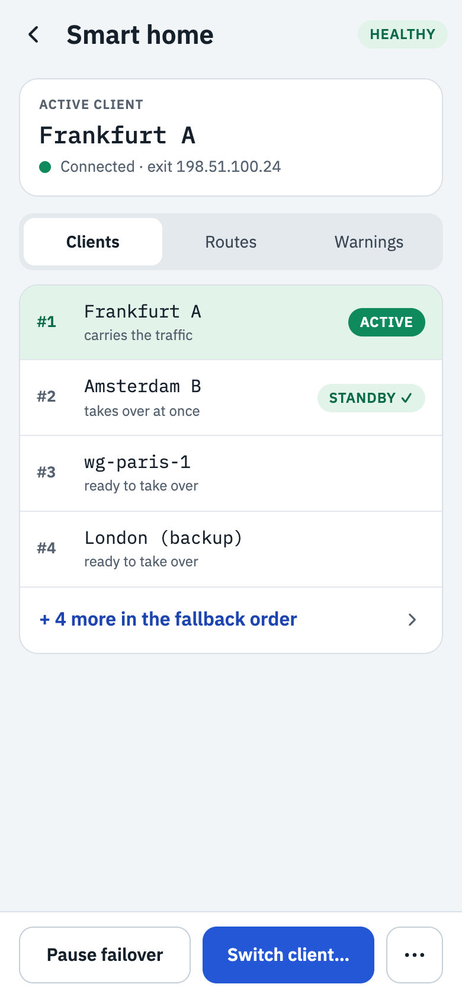

# HA UniFi VPN Watchdog

[](https://github.com/bassem-elsodany/homelab-ha-addons/actions/workflows/ci.yml) [](../LICENSE)

Keeps your UniFi VLANs and devices on a **working** WireGuard VPN: it health-checks the VPN client in use, switches to the next one in your
fallback order when it stops carrying traffic, and shows the whole path on a live status map in Home Assistant. For homelabs with a UniFi
gateway and a WireGuard VPN provider (NordVPN, Mullvad, Proton, your own server, ...). It runs as a Home Assistant add-on or as a plain Docker container.


**Topics:** home-assistant · home-assistant-addon · unifi · wireguard · vpn · nordvpn · failover · watchdog · homelab · self-hosted

## What it does

A **group** is a set of VLANs and/or devices plus an ordered list of UniFi WireGuard VPN clients. The watchdog health-checks the client in use and,
when it stops carrying traffic, **switches on the next client from your fallback order and switches the failed one off**. A group can
also **rotate** to another client on a timer, keep **warm standbys** connected for an instant takeover, and route a **device** (a TV, say)
through its own client. By default the only thing it changes in UniFi is a VPN client's on/off switch: your routing policies are yours, it
warns you when they do not match a group, and it never edits one you made. If you switch on **Routing** for a group, it keeps its own
policy (named `vpnwd: ... made by the VPN Watchdog add-on`) for each picked VLAN or device pointed at the active client, and moves it on failover.
It runs as a Docker container or a Home Assistant add-on, has a web UI (a graphic status map, settings per group, a phone layout, a config
editor), and is configured by one hot-reloaded YAML file. **VPN clients can have any names**: names are shown exactly as you wrote them in
UniFi and are never parsed.

## Screenshots

All screenshots use invented data (made-up devices, networks and addresses).

**Status** (screens 1500 px wide and up; dark and light follow your system). Click a VLAN and its devices open under it; the line shows the
path through the active VPN client to the exit address. The grey column on the right is the group's status, rotation and the legend.

| Dark | Light |
|---|---|
|  |  |

A VLAN that does not use a VPN shows its path straight to the internet. Click a device with its own route to see where that goes:

| VLAN without a VPN | Device with its own route |
|---|---|
|  |  |

**Settings > VPN groups**: pick the VLANs and devices, build the fallback order, turn on warm standbys, rotation and routing per group.



**On a phone** the page switches to an app-like layout with a tab bar:

| Status | A group |
|---|---|
|  |  |

```
            ┌────────────────────── ha-unifi-vpn-watchdog ──────────────────────┐
 UniFi API  │  snapshot ─► health ─► decision ─► enable + test next ─► alert      │
 (read)  ──►│  clients     status     down?      wait CONNECTED       HA/ntfy    │──► UniFi API: switch a VPN client on / off
            │  policies    blackhole  order      (old one off later)  MQTT       │
            └──────────────────────────────┬────────────────────────────────────┘
                                       web UI / API
```

## How failover works

1. **Detect.** Each cycle (default 15 s) it reads tunnel status, then checks three things, because a tunnel can say
   `CONNECTED` while passing nothing:
   status is `CONNECTED` · receive rate is not stuck at 0 while sending (black hole) · an **exit-IP probe** through
   the tunnel returns a working IP that is not your WAN IP (leak) and, only if you typed an expected country for the step, is in that country.
2. **Decide.** A tunnel is *down* after `failure_threshold` bad polls (or `probe_failure_threshold` bad probes).
3. **Pick.** Candidates come from the group's **fallback order**: a numbered list of tunnels you set yourself. #1 is used when
   it works; if the active tunnel fails the watchdog tries #1, #2, #3 ... skipping tunnels that failed recently. Tunnels can be
   called anything and are never interpreted, sorted or pattern-matched.
4. **Test before switching.** The candidate is switched on and must reach `CONNECTED`. A candidate that fails is quarantined with
   exponential backoff and the next one is tried.
5. **Commit.** The failed client is switched off at the end of the cycle (unless another group still uses it). Without Routing, nothing else
   changes: your own routing policies in UniFi send each VLAN or device through whichever client is up. With Routing on for the group, the
   watchdog also moves its own `vpnwd:` policies to the new client.
6. **Guard rails.** `min_hold_seconds` and `max_switches_per_hour` prevent flapping; hard failures bypass the hold,
   not the hourly cap. If nothing works it alerts once and leaves the current client as it is.
7. **Fail back.** When a tunnel higher in your list (a lower number) has tested healthy for `stable_seconds`, traffic moves back
   up to it. It never moves down or sideways while the active tunnel is healthy.
8. **One client switched on per group.** Only the client in use stays switched on (plus the warm standbys you asked for); every other client
   of the group is switched off, so traffic never leaves through two exit IPs at once. A VPN client that another group uses, or that carries
   a device's own route, is never switched off.

Safe start: until you set a fallback order the watchdog only watches the tunnel in use and never switches anything.

## Install as a Home Assistant add-on

The project folder **is** the add-on (`config.yaml`, `Dockerfile`, `DOCS.md`).

1. Copy the folder to `/addons/ha_unifi_vpn_watchdog` on the HA host (Samba or SSH add-on), then *Settings → Add-ons → Add-on
   Store → ⋮ → Check for updates* and install **HA UniFi VPN Watchdog** from *Local add-ons*. (Requires HA OS or Supervised;
   on a Container install run the Docker image next to HA and use the MQTT + REST pieces below.)
2. **Configuration** tab: `unifi_api_key`, optionally `notify_service` (e.g. `notify.mobile_app_myphone`).
3. Start. A `config.yaml` is created in the add-on config folder. Open **VPN Watchdog** in the sidebar and add a group under **Settings > VPN groups**.

| HA feature | How |
|---|---|
| Status map | sidebar panel → *Status*: the VLANs and their devices, an animated path through the active VPN client to the exit address, the fallback order as a rack of numbered units, and the group's status, rotation and legend in a column on the right; click a VLAN, a device or a client for details. Phones get their own layout |
| Settings UI | sidebar panel → *Settings* tab (form: intervals, thresholds, fallback order, alerts); secrets via the add-on Configuration tab |
| Status / jobs / start-stop | sidebar panel (ingress, authenticated by your HA login) |
| Notifications | `home_assistant` notifier with `supervisor: true`, plus ntfy / Telegram / webhook |
| Entities | MQTT discovery: *Active tunnel, Fallback step, Last decision, Healthy, Failover paused (switch), Force tunnel (select)* per group |
| Logs | add-on *Log* tab |

## Run it without Home Assistant (Docker)

The watchdog is a standalone service; the add-on is just a wrapper around it. You get the failover, rotation, routing, the web UI and the
notifiers (ntfy, Telegram, webhook, or Home Assistant with a URL and token). You lose the sidebar panel and automatic login (use the control token),
the add-on store's one-click updates, and the add-on Log tab (use `docker logs`). HA entities still appear through MQTT discovery if both use the same broker.
Run it on any Docker host that can reach your UniFi gateway, and do not run it next to the add-on against the same VPN clients.

**1. Pre-built image** (amd64 and arm64, so a Raspberry Pi works):

```bash
cp .env.example .env                               # set UNIFI_API_KEY and WATCHDOG_CONTROL_TOKEN
cp config/config.example.yaml config/config.yaml   # set your gateway address, then add groups in the UI
docker compose -f docker/docker-compose.yml up -d  # pulls ghcr.io/bassem-elsodany/ha-unifi-vpn-watchdog:latest
open http://<host>:8080                            # enter the control token to edit, switch and start/stop
```

**2. Build it yourself:** `docker build -f docker/Dockerfile -t ha-unifi-vpn-watchdog .` (add `buildx --platform linux/arm64,linux/amd64` for a Pi),
then point `image:` in `docker/docker-compose.yml` at it.

**3. From source, no container:**

```bash
pip install -e '.[dev]'
ha-unifi-vpn-watchdog validate -c config/config.yaml --env-file .env     # config sanity
ha-unifi-vpn-watchdog discover -c config/config.yaml --env-file .env     # tunnels, routes, resolved ladders
ha-unifi-vpn-watchdog once     -c config/config.yaml --env-file .env     # run one cycle and print the status
pytest
```

`/healthz` answers 200 while the check loop is completing cycles. A 503 that does not clear after a minute usually means the gateway address or API key is wrong (the error is in `docker logs` and in the `error` field of the response).

## Probe modes (`probe.mode`)

| mode | what it does | use when |
|---|---|---|
| `none` | status + black-hole checks only | default |
| `direct` | probe from the watchdog's own egress | the watchdog itself is routed through the VPN |

The earlier `canary` and `remote` modes steered a test device through each tunnel by changing a routing policy and were removed (a config that
still asks for them is refused with an explanation).

Geo-IP databases disagree on VPN address ranges. Keep several endpoints; set
`probe.check_country: false` if you only want "works and is not a leak".

## Alerts

Each alert has an on/off switch, a title and a message with `{placeholders}` (`{group} {tunnel} {previous} {step}
{reason} {tried} ...`), editable in *Settings → Notifications* or under `alerts:` in the YAML:

| alert | sent when | default |
|---|---|---|
| `switch` | a tunnel failed and traffic moved to another tunnel | on |
| `failback` | the preferred tunnel recovered and traffic moved back | on |
| `rotation` | the rotation job moved the group to another tunnel on its schedule | on |
| `rotation_failed` | a rotation was due but no other tunnel passed the test, so nothing moved | on |
| `exhausted` | the active tunnel is down and every candidate failed (critical) | on |
| `leak` | the exit-IP test saw your real WAN address (critical) | on |
| `recovered` | a tunnel is healthy again after `exhausted` | on |
| `blocked` | a switch was needed but held back by the anti-flapping limits | on |
| `startup` | the watchdog (re)started | off |
| `config_error` | a saved configuration was rejected | on |

## Configuration

Secrets come from the environment (Docker: the `.env` file; add-on: the Configuration tab). Everything else is in `config.yaml`, edited in the
web UI or by hand. There are **no default accounts or passwords**: the UI is read-only until you set a control token.

| Variable | Needed | Meaning |
|---|---|---|
| `UNIFI_API_KEY` | yes | UniFi API key (UniFi > Settings > Integrations). The watchdog only needs the Network application. |
| `UNIFI_URL` / `unifi.url` | yes if different | Your gateway address. The built-in default is `https://10.0.1.1`, which is only right if that happens to be yours. |
| `WATCHDOG_CONTROL_TOKEN` | to control it | Bearer token for switching, editing and start/stop. Unset: the server is read-only. Not used inside Home Assistant (ingress). |
| `WATCHDOG_CONFIG` | no | Path of `config.yaml` (`/config/config.yaml` in the container). |
| `NTFY_TOKEN`, `TELEGRAM_BOT_TOKEN`, `TELEGRAM_CHAT_ID`, `HA_TOKEN` | optional | Credentials for the notifier you choose. |

See [config/config.example.yaml](config/config.example.yaml); every key is documented there. Highlights:

- **Fallback order** (`groups[].order`): the sequence of tunnels, first = most preferred. Each entry is an exact tunnel name,
  or `{tunnel: NAME, expect_country: IT}` if the exit-IP test should check a country that you typed yourself. Tunnels not in the
  list are never used. Empty means the watchdog only watches. Set it in *Settings > Fallback order* (type a position number to move).
- **A group** = the VLANs and devices (picked by MAC) it is for + an ordered list of VPN clients. A VPN client can be in several groups: a group is
  only a set of routing policies, and several policies can use one tunnel; a shared client stays on while any group uses it. A device (a TV, a
  camera) gets its own policy, kept above the VLAN policies, and a device belongs to one group. **Routing is opt-in per group**: without it the
  watchdog only warns when UniFi's policies do not match (and offers to switch off one of your policies that blocks a group, **only after you confirm**);
  with it, the watchdog keeps its own `vpnwd:` policy per picked VLAN or device on the active client. It never edits a policy it did not create.
- **Warm standbys.** `keep_ready: N` keeps the next N-1 clients of the order connected so a failover is instant (they show as STANDBY).
- **VPN client names** are never interpreted: no country, city or naming pattern is assumed, and everything shows the name exactly as in UniFi.
- **Renames are safe.** Groups store each tunnel of the fallback order by its UniFi id, with the name only as a label. Renaming a
  VPN client in UniFi changes nothing (the label in `config.yaml` follows). The Status page is drawn from UniFi's own state on every check
  (default every 15 s, or press *Check now*): which policy applies to which VLAN, and to which device, is read, never remembered.
- **Jobs.** Failover is every group's first job. A group can also have a **rotation** job (Settings > VPN groups > Rotation): every N hours, days or weeks
  (days and weeks at a time of day) the group moves to the next tunnel in its fallback order, or to a random one from the order. The
  new tunnel is connected and tested first; one that fails is skipped. Each job has its own switch; "Rotate now" and "Stop rotation"
  are on the Status page. Failover keeps working between rotations; failback to a higher tunnel is paused while a rotation job is on.
  ```yaml
  jobs:
    - {group: iot-and-vpn, kind: rotation, every: 1, unit: days, at: "03:00", go_to: next}   # unit: hours | days | weeks, go_to: next | random
  ```
- **Per-group overrides** for any `detection`, `switching`, `failback` key.
- **Hot reload**: edit the file (or use the UI), it is applied next cycle; an invalid file is rejected and the old
  config keeps running. Typos are errors (unknown keys are rejected). `${VAR}` / `${VAR:-default}` read the environment.

## API (same server as the UI)

Read without auth: `GET /healthz`, `/api/status`, `/metrics` (Prometheus). Control needs `Authorization: Bearer <control_token>`
(or HA ingress): `POST /api/groups/{name|*}/pause|resume`, `/api/groups/{name}/switch|test {"tunnel": "..."}`,
`/api/check-now`, `GET|POST /api/config`, `POST /api/config/validate`.
With no `control_token` set the server is read-only.

## Things learned the hard way (all handled in code)

- Disabling a VPN client does not delete or disable its routing policy: UniFi simply skips a policy whose client is off. UniFi also uses the
  **first** enabled policy that matches, and a new policy is added at the end of the list, so when Routing is on the watchdog re-creates its own
  VLAN policies below its device policies (new copy first, then the old one is deleted).
- UniFi rejects overlapping client subnets (`SubnetOverlapped`), so each tunnel needs a unique `10.5.x.2/24`.
- Servers showing 0 % load never connected in testing; pick servers with some load and let the quarantine skip duds.
- Use `traffic-flows` (UniFi) as independent proof of where traffic exits; the watchdog never trusts a single signal.

## Roadmap

- **Failover on speed or delay**, per group (for example: fail over when the download is below 20 Mbps). UniFi has no speed test or ping for a VPN
  client (its speed test measures WAN lines only), so this needs a small dedicated test device that the watchdog routes through a client for a few
  seconds at a time. Not built yet.

## Layout

```
src/vpn_watchdog/   config · unifi · probe · ladder · engine · state · notify · settings · server+ui · safe_mode · ha_mqtt · cli
tests/              183 tests (fake UniFi + fake probe drive the engine; HTTP mocked for the clients)
docker/             Dockerfile · docker-compose.yml
config/             config.example.yaml
config.yaml, Dockerfile, DOCS.md   Home Assistant add-on manifest/build/docs
```

## License

[MIT](../LICENSE) © 2026 Bassem Elsodany.
